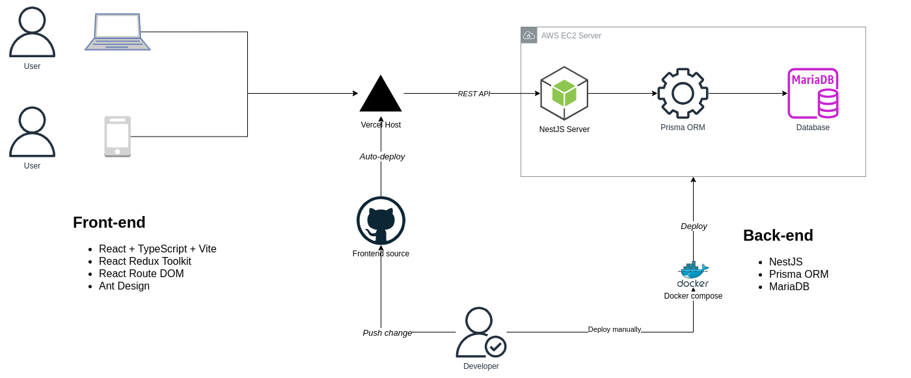

# Economy app

Application is hosted at https://economy-smoky.vercel.app/

### Functionality

    - CRUD operation
    - Image upload
    - Access token authentication



### Libraries

A following stack of libraries are used to build the application:

#### Frontend:

    - React + TypeScript + Vite
    - React Redux Toolkit
    - React Router Dom
    - Localstorage for Authentication
    - Ant Design

#### Backend:

    - NestJS
    - Prisma ORM
    - MariaDB
    - Docker
    - AWS EC2

# Frontend installation

```bash
cd frontend

# Install dependencies
npm install

# Start

npm run dev
```

# Backend installation

## Prisma create migration and run it into DB command

```bash
# Create network
docker network create database

# Buld image
docker compose build --build-arg UID=$(id -u) --build-arg GID=$(id -g) --no-cache

# Install dependencies
docker compose run --rm backend pnpm install

# Generate prisma client
docker compose run --rm backend pnpx prisma generate

# Generate database schema
mkdir -p data && docker compose up
docker compose run --rm backend pnpx prisma migrate dev --name init

# Connect to running database container
docker compose exec database bash
mysql -uroot -p
```
